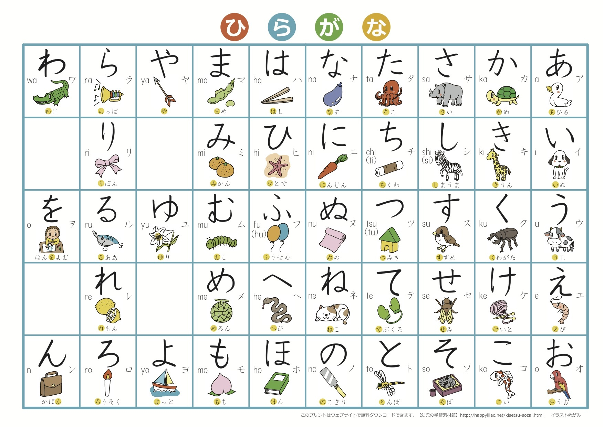

# Japanese

## 清音  
<table>
  <tr>
    <td align="center"> </td>
    <td align="center"><a href="#">a</a></td>
    <td align="center"><a href="#">i</a></td>
    <td align="center"><a href="#">u</a></td>
    <td align="center"><a href="#">e</a></td>
    <td align="center"><a href="#">o</a></td>
  </tr>
   <tr>
    <td align="center"> </td>
    <td align="center"><a href="#">あ</a></td>
    <td align="center"><a href="#">い</a></td>
    <td align="center"><a href="#">う ウ</a></td>
    <td align="center"><a href="#">え</a></td>
    <td align="center"><a href="#">お</a></td>
  </tr>
  <tr>
    <td align="center">K</td>
    <td align="center"><a href="#">か</a></td>
    <td align="center"><a href="#">き</a></td>
    <td align="center"><a href="#">く</a></td>
    <td align="center"><a href="#">け</a></td>
    <td align="center"><a href="#">こ</a></td>
  </tr>
  <tr>
    <td align="center">S</td>
    <td align="center"><a href="#">さ</a></td>
    <td align="center"><a href="#">し</a></td>
    <td align="center"><a href="#">す</a></td>
    <td align="center"><a href="#">せ</a></td>
    <td align="center"><a href="#">そ</a></td>
  </tr>
  <tr>
    <td align="center">T</td>
    <td align="center"><a href="#">た</a></td>
    <td align="center"><a href="#">ち</a></td>
    <td align="center"><a href="#">つ</a></td>
    <td align="center"><a href="#">て</a></td>
    <td align="center"><a href="#">と</a></td>
  </tr>
  <tr>
    <td align="center">N</td>
    <td align="center"><a href="#">な</a></td>
    <td align="center"><a href="#">に</a></td>
    <td align="center"><a href="#">ぬ</a></td>
    <td align="center"><a href="#">ね</a></td>
    <td align="center"><a href="#">の</a></td>
  </tr>
  <tr>
    <td align="center">H</td>
    <td align="center"><a href="#">は</a></td>
    <td align="center"><a href="#">ひ</a></td>
    <td align="center"><a href="#">ふ</a></td>
    <td align="center"><a href="#">へ</a></td>
    <td align="center"><a href="#">ほ</a></td>
  </tr>
  <tr>
    <td align="center">M</td>
    <td align="center"><a href="#">ま</a></td>
    <td align="center"><a href="#">み</a></td>
    <td align="center"><a href="#">む</a></td>
    <td align="center"><a href="#">め</a></td>
    <td align="center"><a href="#">も</a></td>
  </tr>
  <tr>
    <td align="center">Y</td>
    <td align="center"><a href="#">や</a></td>
    <td align="center"></td>
    <td align="center"><a href="#">ゆ</a></td>
    <td align="center"></td>
    <td align="center"><a href="#">よ</a></td>
  </tr>
  <tr>
    <td align="center">R</td>
    <td align="center"><a href="#">ら</a></td>
    <td align="center"><a href="#">り</a></td>
    <td align="center"><a href="#">る</a></td>
    <td align="center"><a href="#">れ</a></td>
    <td align="center"><a href="#">ろ</a></td>
  </tr>
  <tr>
    <td align="center">W</td>
    <td align="center"><a href="#">わ</a></td>
    <td align="center"></td>
    <td align="center"></td>
    <td align="center"></td>
    <td align="center"><a href="#">を</a></td>
  </tr>
  <tr>
    <td align="center">N</td>
    <td align="center"><a href="#">ん</a></td>
    <td align="center">
    </td>
    <td align="center">
    </td>
    <td align="center">
    </td>
    <td align="center">
    </td>
  </tr>
</table>	

### 浊音

<table>
  <tr>
    <td align="center"> </td>
    <td align="center"><a href="#">a</a></td>
    <td align="center"><a href="#">i</a></td>
    <td align="center"><a href="#">u</a></td>
    <td align="center"><a href="#">e</a></td>
    <td align="center"><a href="#">o</a></td>
  </tr>
  <tr>
    <td align="center">G</td>
    <td align="center"><a href="#">が ガ</a></td>
    <td align="center"><a href="#">ぎ ギ</a></td>
    <td align="center"><a href="#">ぐ グ</a></td>
    <td align="center"><a href="#">げ ゲ</a></td>
    <td align="center"><a href="#">ご ゴ</a></td>
  </tr>
  <tr>
    <td align="center">Z</td>
    <td align="center"><a href="#">ざ ザ</a></td>
    <td align="center"><a href="#">じ ジ</a></td>
    <td align="center"><a href="#">ず ズ</a></td>
    <td align="center"><a href="#">ぜ ゼ</a></td>
    <td align="center"><a href="#">ぞ ゾ</a></td>
  </tr>
  <tr>
    <td align="center">D</td>
    <td align="center"><a href="#">だ ダ</a></td>
    <td align="center"><a href="#">ぢ ヂ</a></td>
    <td align="center"><a href="#">づ ヅ</a></td>
    <td align="center"><a href="#">で デ</a></td>
    <td align="center"><a href="#">ど ド</a></td>
  </tr>
  <tr>
    <td align="center">B</td>
    <td align="center"><a href="#">ば バ</a></td>
    <td align="center"><a href="#">び ビ</a></td>
    <td align="center"><a href="#">ぶ ブ</a></td>
    <td align="center"><a href="#">べ ベ</a></td>
    <td align="center"><a href="#">ぼ ボ</a></td>
  </tr>
  <tr>
    <td align="center">P</td>
    <td align="center"><a href="#">ぱパ</a></td>
    <td align="center"><a href="#">ぴ ピ</a></td>
    <td align="center"><a href="#">ぷ プ</a></td>
    <td align="center"><a href="#">ぺ ペ</a></td>
    <td align="center"><a href="#">ぽ ポ</a></td>
  </tr>
</table>  
	
### 拗音
<table>
  <tr>
    <td align="center"> </td>
    <td align="center"><a href="#">a</a></td>
    <td align="center"><a href="#">u</a></td>
    <td align="center"><a href="#">o</a></td>
  </tr>
  <tr>
    <td align="center">KY</td>
    <td align="center"><a href="#">きゃ キャ</a></td>
    <td align="center"><a href="#">きゅ キュ</a></td>
    <td align="center"><a href="#">きょ キョ</a></td>
  </tr>
  <tr>
    <td align="center">SH</td>
    <td align="center"><a href="#">しゃ シャ</a></td>
    <td align="center"><a href="#">しゅ シュ</a></td>
    <td align="center"><a href="#">しょ ショ</a></td>
  </tr>
  <tr>
    <td align="center">CH</td>
    <td align="center"><a href="#">ちゃ チャ</a></td>
    <td align="center"><a href="#">ちゅ チュ</a></td>
    <td align="center"><a href="#">ちょ チョ</a></td>
  </tr>
  <tr>
    <td align="center">NY</td>
    <td align="center"><a href="#">にゃ ニャ</a></td>
    <td align="center"><a href="#">にゅ ニュ</a></td>
    <td align="center"><a href="#">にょ ニョ</a></td>
  </tr>
  <tr>
    <td align="center">HY</td>
    <td align="center"><a href="#">ひゃ ヒャ</a></td>
    <td align="center"><a href="#">ひゅ ヒョ</a></td>
    <td align="center"><a href="#">ひょ ヒョ</a></td>
  </tr>
  <tr>
    <td align="center">MY</td>
    <td align="center"><a href="#">みゃ ミャ</a></td>
    <td align="center"><a href="#">みゅ ミュ</a></td>
    <td align="center"><a href="#">みょ ミョ</a></td>
  </tr>
  <tr>
    <td align="center">RY</td>
    <td align="center"><a href="#">りゃ リャ</a></td>
    <td align="center"><a href="#">りゅ リュ</a></td>
    <td align="center"><a href="#">りょ リョ</a></td>
  </tr>
  <tr>
    <td align="center">GY</td>
    <td align="center"><a href="#">ぎゃ ギャ</a></td>
    <td align="center"><a href="#">ぎゅ ギュ</a></td>
    <td align="center"><a href="#">ぎょ ギョ</a></td>
  </tr>
  <tr>
    <td align="center">J</td>
    <td align="center"><a href="#">じゃ ジャ</a></td>
    <td align="center"><a href="#">じゅ ジュ</a></td>
    <td align="center"><a href="#">じょ ジョ</a></td>
  </tr>
  <tr>
    <td align="center">BY</td>
    <td align="center"><a href="#">びゃ ビャ</a></td>
    <td align="center"><a href="#">びゅ ビュ</a></td>
    <td align="center"><a href="#">ぎょ ギョ</a></td>
  </tr>
  <tr>
    <td align="center">PY</td>
    <td align="center"><a href="#">ぴゃ ピャ</a></td>
    <td align="center"><a href="#">ぴゅ ピュ</a></td>
    <td align="center"><a href="#">ぴょ ピョ</a></td>
  </tr>
</table> 

## 辅助掌握词汇以帮助记忆五十音  

### 清音组成的词语
<table>

  <tr>
    <td >せんせい（先生）</td>
    <td >〔名〕 老师</td>
  </tr>
  <tr>
    <td >ちち（父）</td>
    <td >〔名〕 （我）父亲</td>
  </tr>
   <tr>
    <td >ちち（父）</td>
    <td >〔名〕 （我）父亲</td>
  </tr>  
  <tr>
    <td >わたし</td>
    <td >〔代〕 我</td>
  </tr>  
   <tr>
    <td >あなた</td>
    <td >〔代〕 你</td>
  </tr> 

  <tr>
    <td>こんにちは</td>
    <td>你好</td>
  </tr>
  <tr>
    <td>すみません</td>
    <td>对不起，请问(可以当Excuse me用)</td>
  </tr>
  <tr>
    <td>はい</td>
    <td>〔叹〕 哎，是（应答）；是的</td>
  </tr>
  <tr>
    <td>いいえ</td>
    <td>〔叹〕 不，不是</td>
  </tr>
  <tr>
    <td>おはよう</td>
    <td>早上好</td>
  </tr>
  <tr>
    <td>そら</td>
    <td>空</td>
  </tr>
</table>

<table>
  <tr>
    <td>ちゅうごくじん （中国人） </td>
    <td>〔名〕 中国人</td>
  </tr>
  <tr>
    <td>にほんじん（日本人）</td>
    <td>〔名〕 日本人</td>
  </tr>
  <tr>
    <td>かんこくじん（韓国人）</td>
    <td>〔名〕 韩国人</td>
  </tr>
  <tr>
    <td>がくせい（学生）</td>
    <td>〔名 （大）学生</td>
  </tr>
</table> 

大家的日语 
はじ  
初めまして，どうぞよろしく  

初次见面，请多关照

苍井空（日文名：蒼井そら，平假名：あおいそら，罗马拼音：aoi sora，英文名：Aoi sola）  

波多野结衣 (平假名：はたのゆい)

https://github.com/kidynecat/KanaSyllabaryMemory

https://zhuanlan.zhihu.com/p/24500513

http://jp.tingroom.com/tingli/biaozhunriyu/4.html